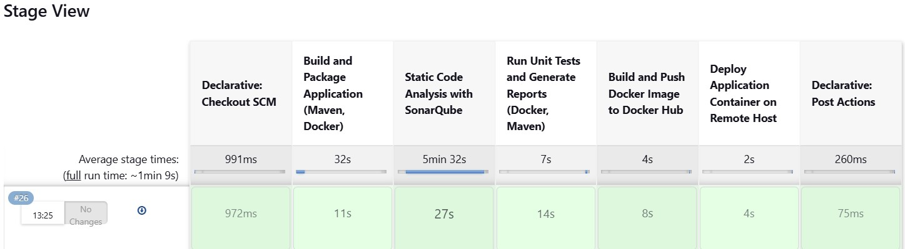

# DevOps Jenkins Pipeline Demo

This repository contains a fully automated CI/CD pipeline using Jenkins, Docker, SonarQube, and GitLab.

Before running it, you need to place a sample Java application in the `./build/java-app` directory.

## Features
✅ Java application built with Maven  
✅ CI/CD pipeline using Jenkins  
✅ Dockerized SonarQube for static code analysis  
✅ Push Docker images to DockerHub  
✅ Deploy container on a remote host 

